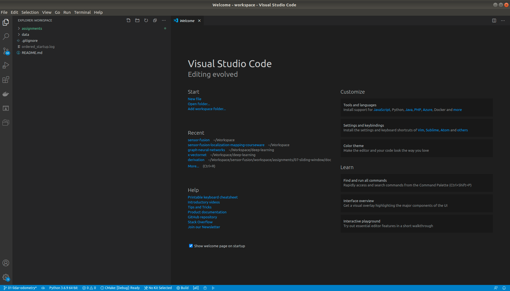

# 基于激光的多传感器融合定位与建图

深蓝学院[多传感器融合定位/Sensor Fusion](https://www.shenlanxueyuan.com/my/course/261)学习环境.

---

## Overview

本Repo为基于**ROS melodic** @ **Ubuntu 18.04**的[多传感器融合定位/Sensor Fusion](https://www.shenlanxueyuan.com/my/course/261)学习环境. 

---

### 安装Ubuntu

首先请确保您可以访问**Ubuntu**开发环境. 如果没有**Ubuntu**环境, 请按照[这个](ubuntu-setup/README.md)指南, 在本地PC上安装配置**Ubuntu**环境.

---

### 获取Docker开发环境

本课程推荐使用官方Docker环境[this guide](docker/README.md)完成课程学习. Docker提供了一个轻量级的标准化开发环境, 能够避免环境配置差异导致的诸多问题.

---

### Workspace

#### 获取课程数据

在第一次使用时, 需要将课程配套的KITTI数据下载至本地. 具体操作方法参考[Here](workspace/data/kitti/README.md)

#### 开发, 编译与测试

启动Docker环境后, **Docker**中的/workspace目录, 会被映射到**当前Repo**中的workspace目录.

使用该Workspace进行开发, 编译与测试的方法如下:

* 在**当前Repo的workspace**下, 启动VSCode, 编辑源代码:

* 在**Docker /workspace**下, 进行编译. 具体的编译方法, 请参考作业0[Hello, KITTI](workspace/assignments/00-hello-kitti/README.md)

---

Keep Learning & Keep Coding