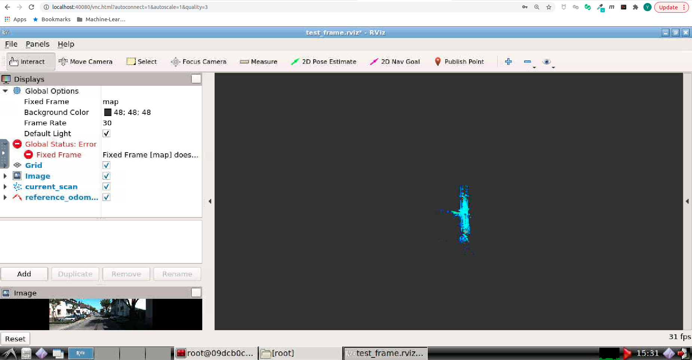

# Sensor Fusion: Lidar Odometry -- 多传感器融合定位与建图: Hello, KITTI

深蓝学院从多传感器融合定位第0节Environment Setup编程作业.

---

## Overview

本作业旨在引导您验证环境配置的正确性, 熟悉课程教学框架.

---

## Getting Started

启动Docker后, 打开浏览器, 进入Web Workspace. 启动Terminator, 将两个Shell的工作目录切换如下:


在**上侧**的Shell中, 输入如下命令, **编译catkin_workspace**

```bash
# build
catkin config --install && catkin build
```

然后**启动解决方案**

```bash
# set up session:
source install/setup.bash
# launch:
roslaunch lidar_localization test_frame.launch
```

在**下侧**的Shell中, 输入如下命令, **Play KITTI ROS Bag**

```bash
# play ROS bag
rosbag play kitti_2011_10_03_drive_0027_synced.bag
```

成功后, 可以看到如下的RViz界面:

