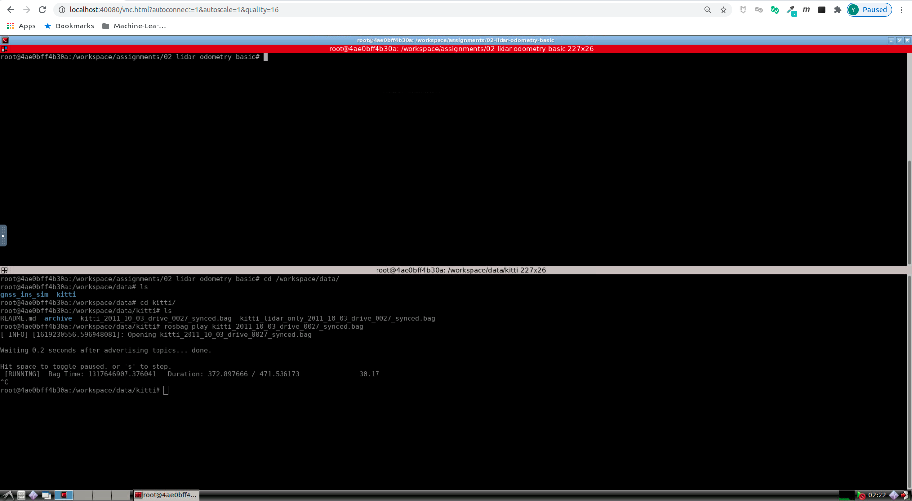
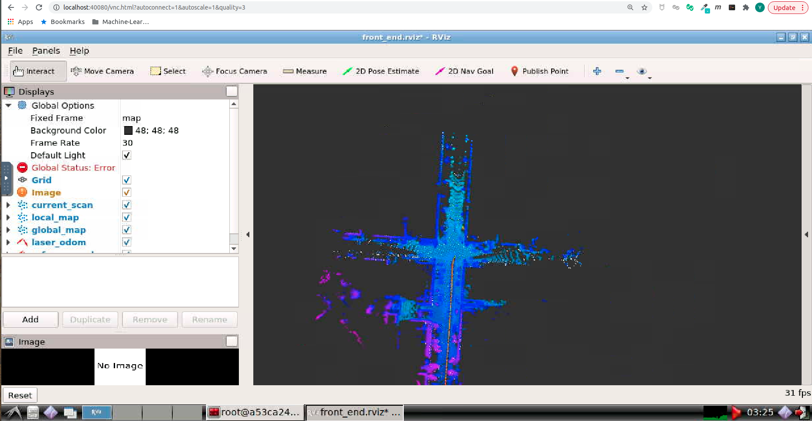

# Multi-Sensor Fusion for Localization & Mapping -- 多传感器融合定位与建图: Lidar Odometry Basic

深蓝学院, 多传感器融合定位与建图, 第2节Lidar Odometry Basic代码框架.

---

## Overview

本作业旨在实现经典的激光里程计算法.

---

## Getting Started

### 及格要求: 跑通提供的工程框架

启动Docker后, 打开浏览器, 前往localhost:40080, 进入Web Workspace. **若需要提高清晰度, 可以更改URL中的quality参数**. 启动Terminator, 将两个Shell的工作目录切换如下:



在**上侧**的Shell中, 输入如下命令, **编译catkin_workspace**

```bash
# build
catkin config --install && catkin build
```

然后**启动解决方案**

```bash
# set up session:
source install/setup.bash
# launch:
roslaunch lidar_localization front_end.launch
```

在**下侧**的Shell中, 输入如下命令, **Play KITTI ROS Bag**. 两个数据集均可用于完成课程, 对代码功能的运行没有任何影响, 区别在于第一个有Camera信息

```bash
# play ROS bag, full KITTI:
rosbag play kitti_2011_10_03_drive_0027_synced.bag
# play ROS bag, lidar-only KITTI:
rosbag play kitti_lidar_only_2011_10_03_drive_0027_synced.bag
```

成功后, 可以看到如下的RViz界面:



### 良好要求: 使用evo计算出分段统计误差和整体轨迹误差

此处以Docker Workspace为例. 在Terminator中添加新窗口, 切换至如下目录:

```bash
cd /workspace/assignments/02-lidar-odometry-basic/src/lidar_localization/slam_data/trajectory
```


该目录下会输出:

* Ground Truth的RTK轨迹估计, ground_truth.txt
* Lidar Frontend的轨迹估计, laser_odom.txt

请使用上述两个文件, 完成**evo**的评估

此处轨迹会有较大的偏移. 在后续的学习中, 你会了解如何修复这个偏移, 获得更好的轨迹估计.

### 优秀要求: 自己实现点云匹配方法，而不是直接调用pcl库的匹配方法，并使用evo计算出指标

# 高能预警: 该作业需要足够的C++与ROS开发基础. 如果没有, 欢迎发挥主观能动性, 在有限的时间内积极Catch Up, 或者选修深蓝学院的相关课程, 留待务实基础之后再来学习.

为了鼓励真正有志研究框架的同学自主探索, 此处仅在有限的几处增加了`TODO`关键字进行思路提示.

请以此为基础, 理解框架结构, 完成作业实现.
