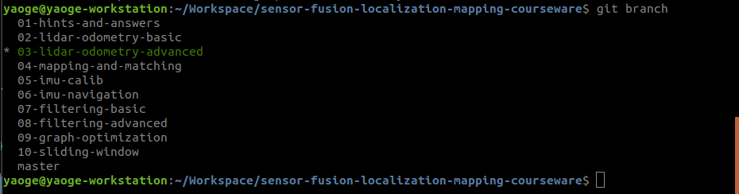
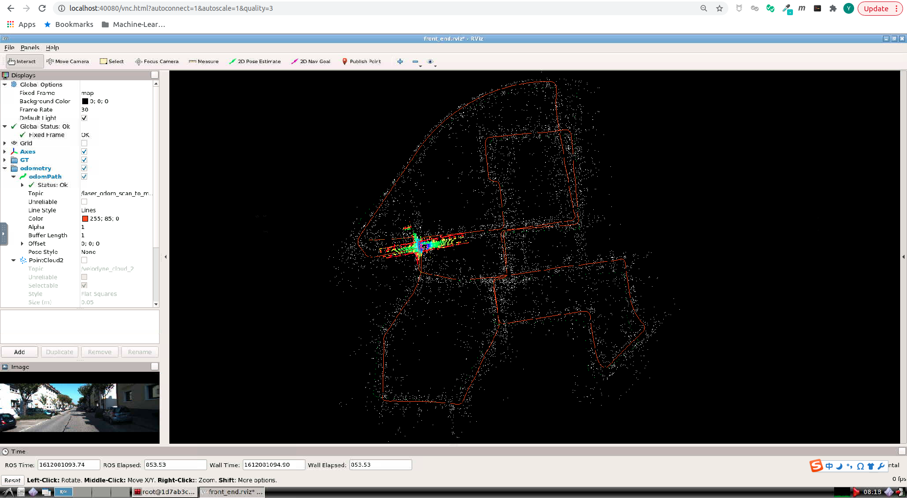
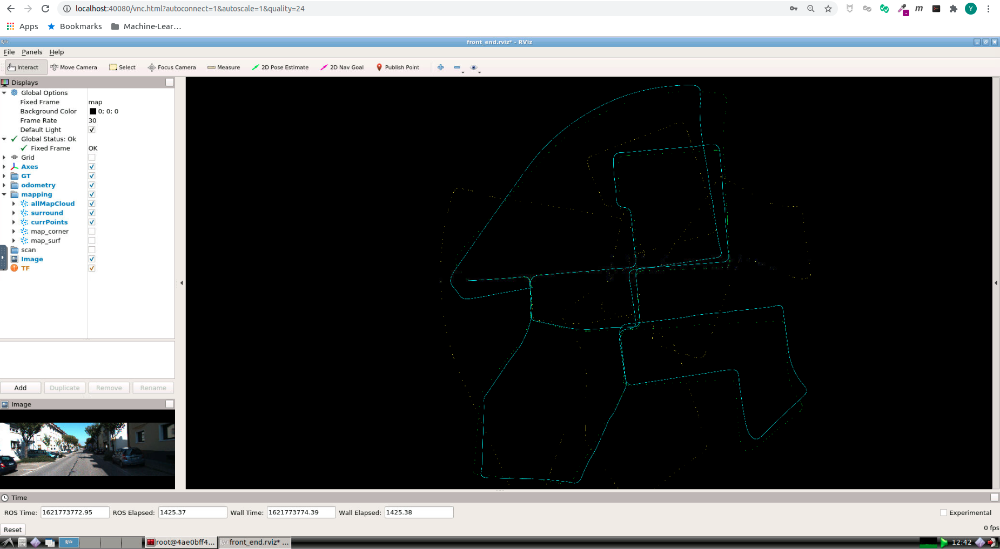

# Multi-Sensor Fusion for Localization & Mapping: 多传感器融合定位与建图: Lidar Odometry Advanced

深蓝学院, 多传感器融合定位与建图, 第3章Lidar Odometry Advanced代码框架.

---

## Overview

本作业旨在实现基于线面特征的激光前端里程计算法.

---

## Getting Started

## Getting Started

### 环境检查: 确保Git Repo与使用的Docker Image均为最新

首先, 请确保选择了正确的branch **03-lidar-odometry-advanced**:



执行以下命令，确保所使用的Git Repo与Docker Image均为最新:

```bash
# update git repo:
git pull
#
# update docker image:
#
# 1. first, login to Sensor Fusion registry -- default password is shenlansf20210122:
docker login --username=937570601@qq.com registry.cn-shanghai.aliyuncs.com
# 2. then download images:
docker pull registry.cn-shanghai.aliyuncs.com/shenlanxueyuan/sensor-fusion-workspace:bionic-cpu-vnc
```

### 及格要求: 推导残差模型的雅可比

Good Luck & 干就完了

### 良好要求: 编程实现新模型的解析式求导

启动Docker后, 打开浏览器, 进入Web Workspace. 启动Terminator, 将两个Shell的工作目录切换如下:


在**上侧**的Shell中, 输入如下命令, **编译catkin_workspace**

```bash
# build
catkin config --install && catkin build
```

然后**启动解决方案**

```bash
# set up session:
source install/setup.bash
# launch:
# option 1: aloam, migration through topic adaptation:
roslaunch lidar_localization aloam.launch
# option 2: aloam, in-depth adaptation for course assignment framework:
roslaunch lidar_localization loam.launch
```

在**下侧**的Shell中, 输入如下命令, **Play KITTI ROS Bag**. 两个数据集均可用于完成课程, 对代码功能的运行没有任何影响, 区别在于第一个有Camera信息

```bash
# play ROS bag, full KITTI:
rosbag play kitti_2011_10_03_drive_0027_synced.bag
# play ROS bag, lidar-only KITTI:
rosbag play kitti_lidar_only_2011_10_03_drive_0027_synced.bag
```

成功后, 可以看到如下的RViz界面:





本次作业的代码框架基于秦通大佬的[ALOAM](https://github.com/HKUST-Aerial-Robotics/A-LOAM)改造. 提供如下的两个版本:

* Option 1: 针对深蓝学院教学框架深度适配版, loam.launch
    * 将ALOAM全部节点按照教学框架设计理念进行重构.

* Option 2: 简易适配版, aloam.launch
    * 仅将Topic Name与课程数据集适配.

请你在此基础上实现**新模型的解析求导**. 请在提交的报告中, 清晰明了地分析你的实现, 将代码实现与你的公式推导相对应. **仅仅跑通框架, 不会得到此题目的分数**

**提示** 本次作业唯一需要修改的文件位于[here](src/lidar_localization/include/lidar_localization/models/loam/aloam_factor.hpp), 请开始你的表演！

### 优秀要求: 给出新模型基于evo的精度评测结果

**注意** 如果你没有提交残差模型的解析实现, 你不会得到此题目的分数

此处以Docker Workspace为例. 在Terminator中添加新窗口, 切换至如下目录:

```bash
/workspace/assignments/03-lidar-odometry-advanced/src/lidar_localization/slam_data/trajectory
```

该目录下会输出:

* 作为Ground Truth的RTK轨迹估计, ground_truth.txt
* Lidar Frontend轨迹估计, laser_odom.txt

请使用上述两个文件, 完成**evo**的评估