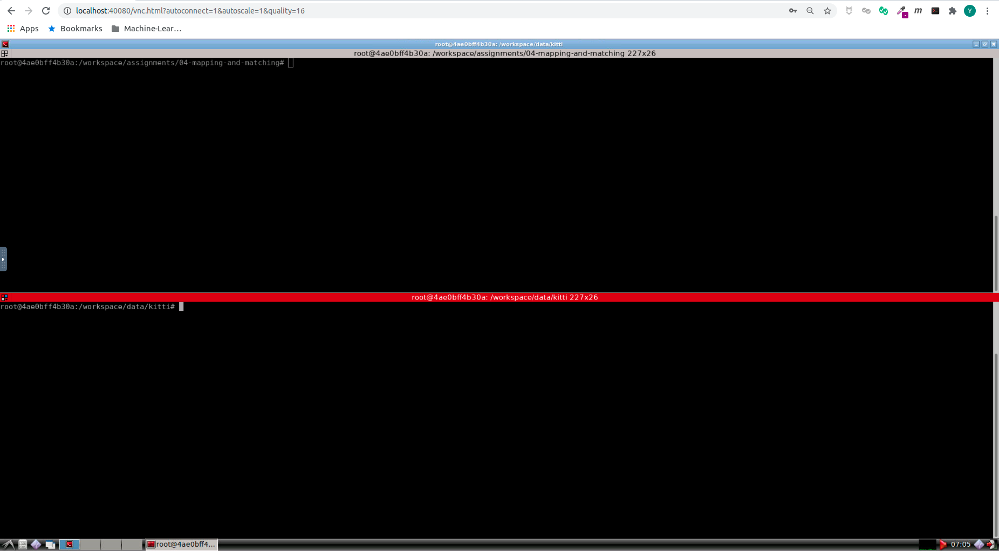
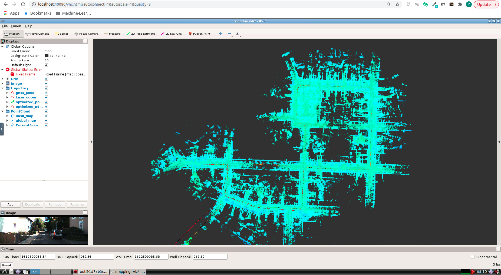
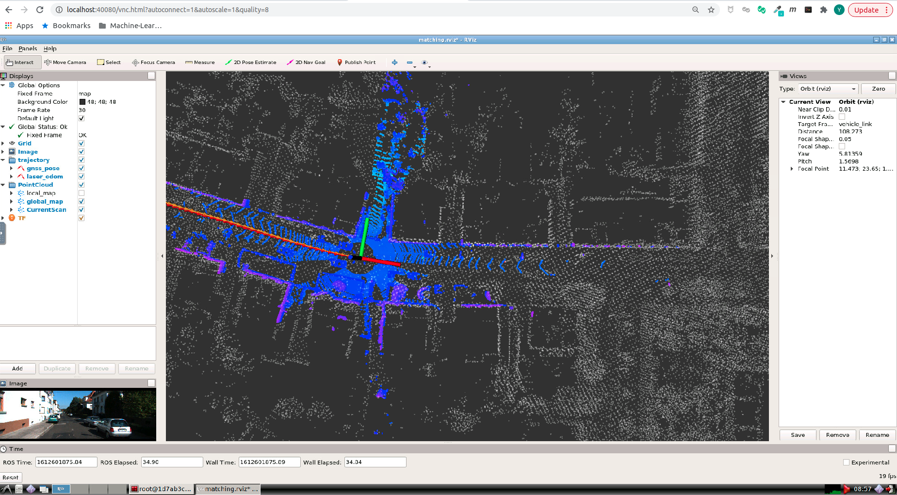

# Sensor Fusion: Lidar Odometry -- 多传感器融合定位与建图: 建图与基于地图的定位

深蓝学院, 多传感器融合定位与建图, 第4章Mapping and Map Based Localization代码框架.

---

## Overview

本作业旨在演示建图流程以及实现基于地图信息的定位初始化.

---

## Getting Started

### 及格要求: 跑通建图流程、保存地图，并截图显示完整地图

启动Docker后, 打开浏览器, 进入Web Workspace. 启动Terminator, 将两个Shell的工作目录切换如下:



在**上侧**的Shell中, 输入如下命令, **编译catkin_workspace**

```bash
# build
catkin config --install && catkin build
```

然后**启动解决方案**

```bash
# set up session:
source install/setup.bash
# launch mapping:
roslaunch lidar_localization mapping.launch
```

在**下侧**的Shell中, 输入如下命令, **Play KITTI ROS Bag**. **注意**: 两个数据集均可用于完成课程, 对代码功能的运行没有任何影响, 区别在于第一个有Camera信息

```bash
# play ROS bag, full KITTI:
rosbag play kitti_2011_10_03_drive_0027_synced.bag
# play ROS bag, lidar-only KITTI:
rosbag play kitti_lidar_only_2011_10_03_drive_0027_synced.bag
```

在运行过程中, 可以执行如下的命令, **保存地图与Loop Closure Data**

```bash
# set up session:
source install/setup.bash
# force backend optimization:
rosservice call /optimize_map
# save optimized map:
rosservice call /save_map 
# if you still use refence Scan Context Loop Closure implementation, execute this command.
rosservice call /save_scan_context 
```

上述三个ROS Service会生成所需的**Map**与**Scan Context Data**. 分别位于:

* **Map**: src/lidar_localization/slam_data/map
* **Scan Context Data**: src/lidar_localization/slam_data/scan_context

成功后, 可以看到如下的RViz界面. **注意**: 该截图**并非完整地图**, 拷贝此图用于提交, 你将不会得到任何分数.



### 良好要求: 在建图的基础上，加载点云地图，实现在地图原点的初始化 (此功能提供的代码已实现)

**启动解决方案如下**. **注意**: 在启动前, 请确保已成功运行Q1, 并保存**Map**以及**Scan Context Data**

```bash
# set up session:
source install/setup.bash
# launch mapping:
roslaunch lidar_localization matching.launch
```

成功后, 可以看到如下的RViz界面. **注意**: 该截图**并非完整地图**, 拷贝此图用于提交, 你将不会得到任何分数.



### 优秀要求: 在建图的基础上，实现全局初始化的要求

全局搜索**TODO**. Good Luck!
